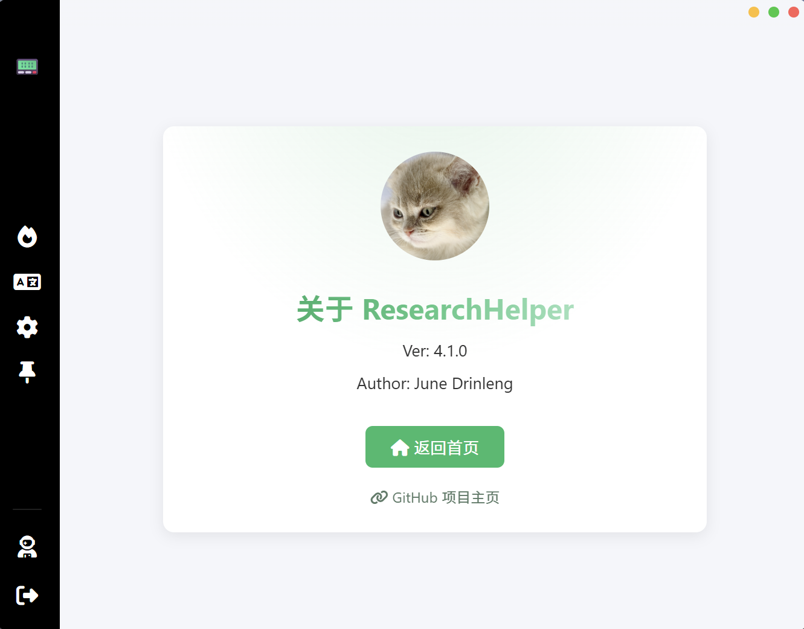
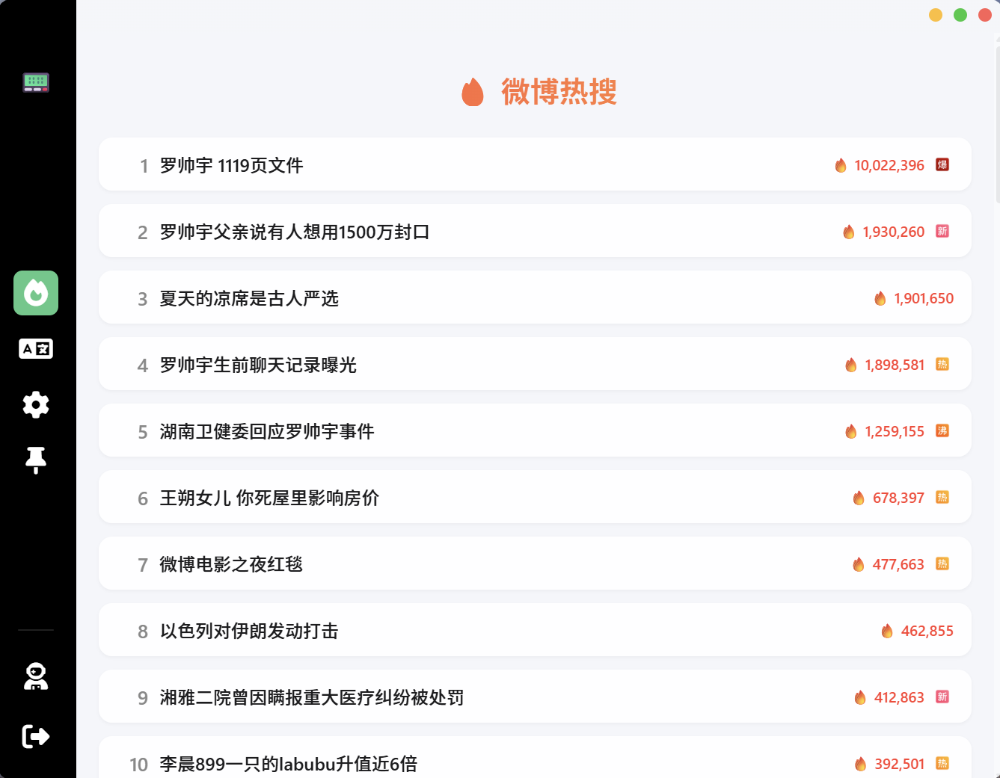
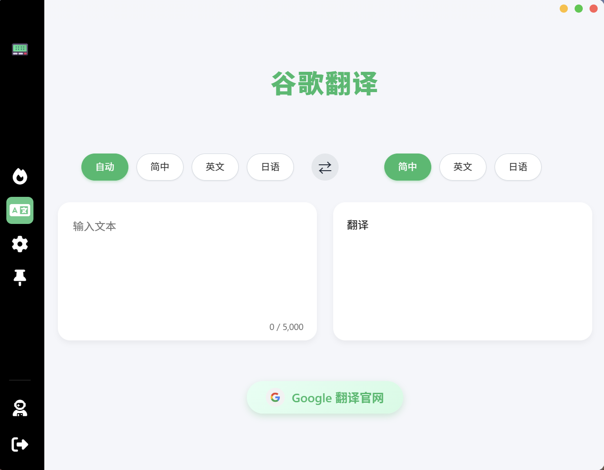
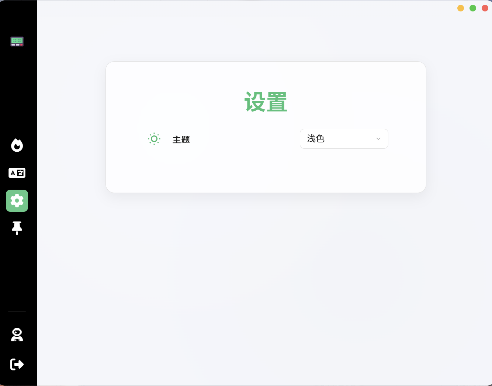

<p align="center">
  
</p>

<h1 align="center">Research Helper 🧑‍🎓</h1>

<p align="center">
  <a href="#quick-start">🚀 快速开始</a> •
  <a href="#appearance--features">🎨 外观与功能</a> •
  <a href="#try-it-yourself">🛠️ 本地编译</a> •
  <a href="#packaging">📦 打包</a> 
</p>

<p align="center" id="language-switch">
  <a href="./README_EN.md"><strong>🅰️ English</strong></a>
</p>

---

## Table of Contents

1. [快速开始](#quick-start)
2. [外观与功能](#appearance--features)
3. [本地编译](#try-it-yourself)
4. [打包](#packaging)


---

<p align="right"><a href="#research-helper 🧑‍🎓">

### 快速开始 🚀

1. 前往 [Releases 页面](https://github.com/JuneDrinleng/ResearchHelper/releases) 下载最新安装包。
2. 双击安装，安装完成后 **Research Helper** 会自动启动。

### 外观与功能 🎨

| 功能         | 说明                            |
| ---------- | ----------------------------- |
| 🌐 便捷上网    | 内置翻译、快速查询等多合一工具               |
| 🌓 浅色/深色主题 | 根据喜好自由切换                      |
| 📕 实时翻译    | 选中文本即刻翻译                      |
| 🔥 微博热搜    | 一键查看并深入了解热门话题                 |
| 📌 窗口置顶    | 让 **Research Helper** 始终保持在最前 |

<div align="center">
  
  
  <br/>
  
  
</div>

### 本地编译 🛠️

#### 后端（Python / FastAPI）

```bash
# 创建并激活虚拟环境
cd backend
python -m venv venv
source venv/bin/activate  # Windows: venv\Scripts\activate

# 安装依赖
pip install -r requirements.txt

# 运行后端服务
python main.py
```

> **提示：** Windows 用户可直接使用 `backend/dist` 中已打包好的 `ResearchHelperService.exe`。

#### 前端（Electron）

```bash
# 安装依赖
npm install

# 开发模式启动
npm start
```

### 打包发布 📦

#### 打包 Python 后端

```bash
cd backend
pyinstaller --onefile --noconsole --name ResearchHelperService --icon=../favicon.ico main.py
```

#### 打包 Electron App（Windows）

```bash
electron-builder --win
```
