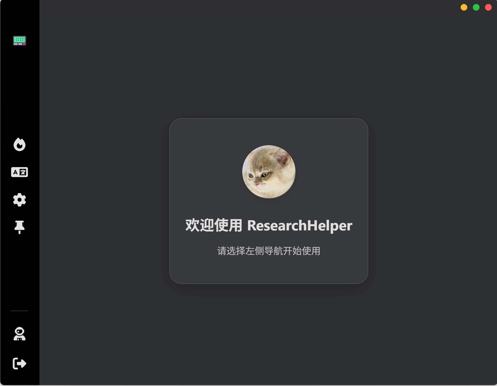
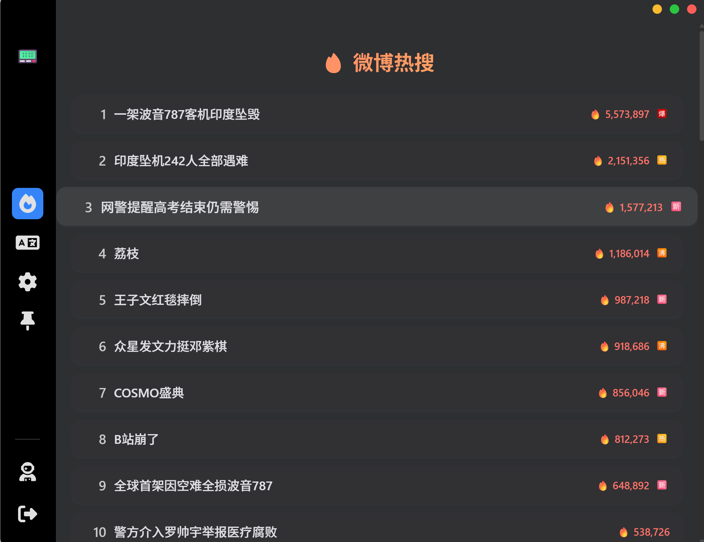
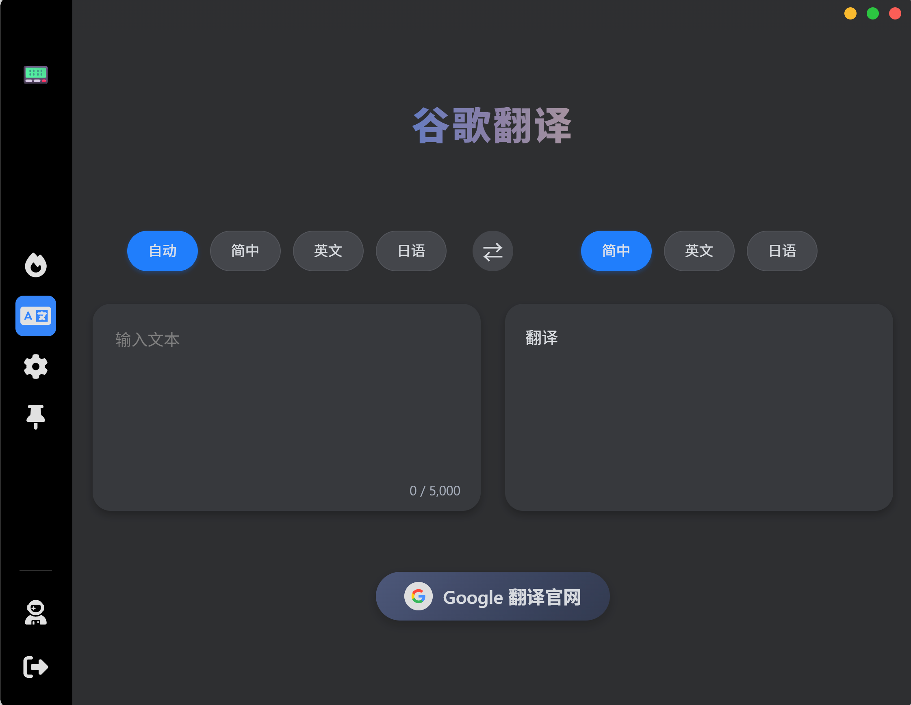
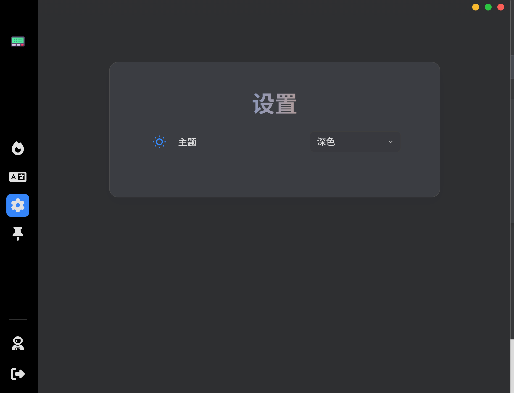

<p align="center">
  
</p>

<h1 align="center">Research Helper 🧑‍🎓</h1>

<p align="center">
  <a href="#quick-start">🚀 Quick Start</a> •
  <a href="#appearance--features">🎨 Appearance & Features</a> •
  <a href="#try-it-yourself">🛠️ Try It Yourself</a> •
  <a href="#packaging">📦 Packaging</a> •
  <a href="#中文版">🇨🇳 中文</a>
</p>

---

## Table of Contents

1. [Quick Start](#quick-start)
2. [Appearance & Features](#appearance--features)
3. [Try It Yourself](#try-it-yourself)
4. [Packaging](#packaging)
5. [中文 (Chinese Version)](#中文版)

---

## Quick Start

Download the latest installer from the [Releases page](https://github.com/JuneDrinleng/ResearchHelper/releases) and double‑click to install.

Once installed, **Research Helper** launches automatically and is ready to assist you. 🎉

---

## Appearance & Features

|  Feature               |  Description                                 |
| ---------------------- | -------------------------------------------- |
| 🌐 Surf the web        | Inline translation, quick look‑ups, and more |
| 🌓 Light / Dark Mode   | Select the look that suits your eyes         |
| 📕 Built‑in Translator | Highlight & translate any text instantly     |
| 🔥 Weibo Hot Topics    | One‑click to explore trending hashtags       |
| 📌 Pin Window          | Keep **Research Helper** always on top       |

<p align="center"> </p>
<p align="center"> </p>

---

## Try It Yourself

### Backend (🔧 Python / FastAPI)

```bash
# 1️⃣ Create and activate a virtual environment
cd backend
python -m venv venv
source venv/bin/activate  # Windows: venv\Scripts\activate

# 2️⃣ Install dependencies
pip install -r requirements.txt

# 3️⃣ Run the backend service
python main.py
```

> **Tip:** If you cloned the repo on Windows you can also use the pre‑built `ResearchHelperService.exe` located in `backend/dist` — no Python setup required.

### Frontend (⚡ Electron + React)

```bash
# Install dependencies
npm install

# Start the app in dev mode
npm start
```

---

## Packaging

### Package the Python Backend

```bash
cd backend
pyinstaller --onefile --noconsole --name ResearchHelperService --icon=../favicon.ico main.py
```

### Package the Electron App (on Windows)

```bash
electron-builder --win
```

---

## 🇨🇳 中文版  <a id="中文版"></a>

<p align="right"><a href="#research-helper 🧑‍🎓">🔙 English Version</a></p>

### 快速开始 🚀

1. 前往 [Releases 页面](https://github.com/JuneDrinleng/ResearchHelper/releases) 下载最新安装包。
2. 双击安装，安装完成后 **Research Helper** 会自动启动。

### 外观与功能 🎨

| 功能         | 说明                            |
| ---------- | ----------------------------- |
| 🌐 便捷上网    | 内置翻译、快速查询等多合一工具               |
| 🌓 浅色/深色主题 | 根据喜好自由切换                      |
| 📕 实时翻译    | 选中文本即刻翻译                      |
| 🔥 微博热搜    | 一键查看并深入了解热门话题                 |
| 📌 窗口置顶    | 让 **Research Helper** 始终保持在最前 |

<div align="center">
  
  
  <br/>
  
  
</div>

### 自己动手试试看 🛠️

#### 后端（Python / FastAPI）

```bash
# 创建并激活虚拟环境
cd backend
python -m venv venv
source venv/bin/activate  # Windows: venv\Scripts\activate

# 安装依赖
pip install -r requirements.txt

# 运行后端服务
python main.py
```

> **提示：** Windows 用户可直接使用 `backend/dist` 中已打包好的 `ResearchHelperService.exe`。

#### 前端（Electron + React）

```bash
# 安装依赖
npm install

# 开发模式启动
npm start
```

### 打包发布 📦

#### 打包 Python 后端

```bash
cd backend
pyinstaller --onefile --noconsole --name ResearchHelperService --icon=../favicon.ico main.py
```

#### 打包 Electron App（Windows）

```bash
electron-builder --win
```

---

<p align="center">✨ Happy Researching! ✨</p>
